# Roosevelt Camp - Workflow Diagrams (Mermaid)

## Version History Timeline

## Parent User Journey

## Counselor User Journey

## Admin Workflow - 5 Phases

## Registration Lifecycle State Diagram

## System Integration - How All Three Roles Connect

## Admin Dashboard Tab Structure

```mermaid
%%{init: {'theme':'base', 'themeVariables': { 'primaryColor':'#8b5cf6'}}}%%
graph LR
    Admin[Admin Dashboard] --> ParentTabs[Parent Tabs]
    Admin --> ChildTabs[Child Tabs]

    ParentTabs --> Dashboard[📊 Dashboard]
    ParentTabs --> Family[👨‍👩‍👧 Family Setup]
    ParentTabs --> Counselor[🏀 Counselor Setup]
    ParentTabs --> Registrations[✅ Registrations]
    ParentTabs --> Pod[📋 Pod Setup]
    ParentTabs --> Camp[⚙️ Camp Setup]
    ParentTabs --> History[📜 History]
    ParentTabs --> Danger[⚠️ Danger Zone]

    Family --> FamChildren{Children}
    FamChildren --> Parents[Parents]
    FamChildren --> Campers[Campers]
    FamChildren --> SessionRegs[Session Registrations]

    Counselor --> CounChildren{Children}
    CounChildren --> CounselorsList[Counselors]
    CounChildren --> Availability[Work Availability]

    Pod --> PodChildren{Children}
    PodChildren --> Assignments[Counselor & Camper<br/>Assignments]

    Camp --> CampChildren{Children}
    CampChildren --> GymRentals[Gym Rental Days]
    CampChildren --> Content[Public Website Content]

    style Family fill:#10b981
    style Counselor fill:#3b82f6
    style Pod fill:#ec4899
    style Camp fill:#f59e0b
```

## Payment Flow

## Camper Registration Flow Detail

```mermaid
%%{init: {'theme':'base', 'themeVariables': { 'primaryColor':'#10b981'}}}%%
flowchart TD
    Start([Parent: Session Registration Tab]) --> NewReg[Click '+New Registration']

    NewReg --> CheckCampers{Has Campers?}
    CheckCampers -->|No| Warning1[⚠️ Yellow Warning:<br/>Add Campers First]
    CheckCampers -->|Yes| Step1[Step 1: Select Camper]

    Warning1 --> GoToCampers[Go to My Campers Tab]

    Step1 --> SingleCamper{Only 1 Camper?}
    SingleCamper -->|Yes| AutoSelect[Auto-Select Camper]
    SingleCamper -->|No| MultiSelect[Multi-Select Campers]

    AutoSelect --> Step2
    MultiSelect --> Step2[Step 2: Select Dates & Sessions]

    Step2 --> ClickDates[Click Calendar Days<br/>☀️ AM & 🌙 PM Buttons]
    ClickDates --> BulkActions{Bulk Actions?}
    BulkActions -->|Yes| WholeWeek[Add Whole Week Button]
    BulkActions -->|Yes| BothSessions[Select Both Sessions Button]
    BulkActions -->|No| Individual[Individual Session Selection]

    WholeWeek --> Calculate
    BothSessions --> Calculate
    Individual --> Calculate[Calculate Total]

    Calculate --> Discounts{Full Week<br/>Selected?}
    Discounts -->|Yes| Apply10[Apply 10% Discount]
    Discounts -->|No| NoDiscount[Regular Pricing<br/>$60/session]

    Apply10 --> Summary
    NoDiscount --> Summary[Step 3: Order Summary]

    Summary --> Submit[Submit Registration]
    Submit --> Modal[✅ Confirmation Modal<br/>Executive Summary<br/>& Next Steps]

    Modal --> PendingApproval[Status: Pending<br/>⚠️ Not Confirmed Until:<br/>✓ Payment Received<br/>✓ Admin Approves]

    style Warning1 fill:#f59e0b
    style Apply10 fill:#10b981
    style Modal fill:#3b82f6
```

---

## Notes

- All diagrams use Mermaid syntax and render in GitHub, VS Code (with extensions), and many documentation platforms
- Timeline shows most recent versions (Feb 7-8, 2026)
- State diagrams show registration lifecycle states
- Sequence diagrams illustrate cross-role interactions
- Flowcharts detail user journeys for each role

*Generated from WORKFLOWS.md - Roosevelt Camp Management System*
